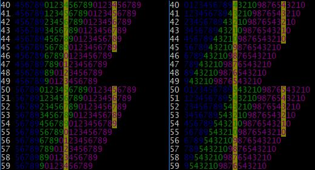

# Adding and subtracting digits with sed

##       Goal

numsed uses sed snippets extracted from Greg Ubben'[dc](http://sed.sourceforge.net/grabbag/scripts/dc.sed) for digit addition and subtraction. We analyse here simplified versions of the snippets without carry (nor decimal part as in dc).

##### Snippet for adding two digits

```
s/(..)/\1;9876543210;9876543210/
s/(.)(.);\d*\1(\d*);(\d*(\2\d*))/\3\5\4/
s/.{10}(.)\d{0,9}(\d{0,1})\d*/0\1\2/
s/0\d(\d)/1\1/
```

(Note that we use \d instead of [0-9] to make the notation lighter.)

This snippet assumes it starts with the pattern space (PS) containing a pair of digits ab. At the end of the snippet, the pattern space contains a + b padded on two digits. 

##### Snippet for subtracting two digits

```
s/(..)/\1;9876543210;0123456789/
s/(.)(.);\d*\2(\d*);(\d*(\1\d*))/\3\5\4/
s/.{10}(.)\d{0,9}(\d{0,1})\d*;/0\1\2/
s/0\d(\d)/1\1/
```

This snippet assumes it starts with a pattern space containing a pair of digits ab. At the end of the snippet, the pattern space contains cd with cd = 0(a - b) if a >= b, or cd = 1(10 + a - b) if a < b. 

The goal of this discussion is:

* to understand how these snippets are constructed,
* to find variants if any,
* to understand the relation between the snippet for addition and the one for subtraction.

##       Techniques

We will see that these snippets use the following techniques:

##### Look up tables

This has been described by Greg Ubben (archived [here](http://sed.sourceforge.net/grabbag/tutorials/lookup_tables.txt)). Look up tables are used here to construct various substrings from the sequences 0123456789 and 9876543210. For instance, to construct a string of a given length we can write:

```
s/(.)/\1;0123456789/
s/(\d);(\d*)\1\d*/\2/
```

If the snippet starts with 5 in PS, it ends with PS containing 01234.

##### Curly braces quantifier

Even if sed doesn't know integers, it has an operator handling explicitly integers. The curly braces quantifier {n} enables to repeat n times the preceding regex. The value n is a constant and the trick will be to modify the length of the string it works on.

##### Shifting indexes

To use the bracket quantifier as an index of constant value, we have to change the string it works on while keeping the result of the indexation. To do that, we use this simple identity:

```
s[x] = (r + s)[x + len(r)]     (i)
```

With these three techniques, the addition and subtraction snippets construct a string from pieces of the sequences 012345678 and 9876543210, and find the result digit with a constant index.

## Notations

To simplify writing, we use the following notations. Given two digits a and b, we note [ab] the string made of ascending digits from a to b if a <= b, or the string of descending digits if a > b. In practice, we use only strings of the following types:  [0a] ('012...a'), [a9] ('a...798'), [9a] ('98... a') or [a0] ('a...210').

Extremities are excluded by using reversed brackets: for instance [a9[ means 'a...78'.

## Properties

By definition of [09] and [90], we can write:
```
c = [09][c]
c = [90][9 - c]
```

Notes:

* index are zero-based,
* we know that c is a character on the left side, and a single digit integer inside the bracket.

Some length properties:

```
len([ab]) = len([ba])
len([0a]) = len([a0]) = a + 1
len([a9]) = len([9a]) = 10 - a
```

Applying the previous identities, we get also:

```
c = [a9][c - a]     if c >= a     (ii)
c = [a0][a - c]     if a >= c     (ii') 
```


<details>
<summary>details</summary>

```
[a9][c - a] = ([0a[ +  [a9])[c - a + a]        using (i)  
            = [09][c] = c
[a0][a - c] = ([9a[ + [a0])[a - c + (9 - a)]   using (i) 
            = [90][9 - c] = c
```
</details>

## Adding two digits

1/ Given two digits a and b, with a + b <= 9, we search the digit a + b by using indexation in the string [90].

```
a + b = [90][9 - (a + b)]                      using (ii')
      = [90][9 - a - b]
      = [90][10 - a - (b + 1)]
      = ([b0] + [90])[10 - a]                  using (i)
      = (]a0] + [b0] + [90])[10]               using (i)
```

We see here the application of the constant index technique: we have constructed a string which gives the expected result with a constant index. Note also that ]a0] is not used in the indexation and could be replaced by any string of length a.

2/ When a + b > 9, we search again the digit  a + b - 10 in the string [90]. 

```
a + b - 10 = [90][9 - (a + b - 10)]            using (ii')
           = [90][19 - a - b]
           = [90][10 - a + 10 - (b + 1)]
           = ([b0] + [90])[10 - a + 10]        using (i)
           = (]a0] + [b0] + [90])[10 + 10]     using (i)
           = (]a0] + [b0] + [90])[20]
```
3/ We can also write the following as b - (a + b - 10) = 10 - a >= 0.

```
a + b - 10 = [b0][b - (a + b - 10)]            using (ii')
           = [b0][10 - a]
           = (]a0] + [b0])[10]                 using (i)
```
Finally as len(]a0] + [b0]) = a + b + 1 > 10, we can add whatever string at the right of ]a0] + [b0] without changing the result:
```
 a + b - 10 = (]a0] + [b0] + [90])[10]  
```

4/ Summarizing

We have found so far that:

* if a + b <= 9,  (]a0] + [b0] + [90])[10] = a + b
* if a + b > 9,  (]a0] + [b0] + [90])[10] = a + b - 10
* if a + b > 9,  (]a0] + [b0] + [90])[20] = a + b - 10

To complete, we note that if a + b <= 9, (]a0] + [b0] + [90])[20] is not defined.

5/ Time to construct the snippet

We assume that PS contains the two digits to add, PS = ab, when starting the snippet.

1st step: we construct a double look up table to be used to extract ]a0] and [b0] :

```
s/(..)/\1;9876543210;9876543210/               PS: ab;9876543210;9876543210
```

2nd step: we extract ]a0] and [b0] from the two sequences of digit, and we complete with [90]:

```
s/(.)(.);\d*\1(\d*);(\d*(\2\d*))/\3\5\4/       PS: ]a0] + [b0] + [90]
```

3rd step: we keep in PS the 11th digit and the 21st if it exists. Carry is anticipated by adding a zero.

```
s/.{10}(.)\d{0,9}(\d{0,1})\d*/0\1\2/           PS: 0x if a + b <= 9, or 0xx if >= 9
```

Note that this always matches, whether the 21st digit exists or not.  

4th step: if the 21st digit has been found, there is a carry to 1 and we set it. Otherwise we have a carry to 0 and it is already there.

```
s/0\d(\d)/1\1/                                 PS: 0x if a + b <= 9, or 1x if a + b > 9
```

That's it.

## Variants

##### Indexing 0123456789 rather than 9876543210

Is there any reason the original dc snippet use 9876543210 rather than 01234567890? The answer is no. We can follow the same steps as previously.


<details>
<summary>details</summary>

```
* if a + b < 10

a + b = [09][a + b]
      = [09][10 - (10 - a) + 10 - (10 - b)]
      = ([a9] + [b9] + [09])[20]

a + b = [b9][a + b - b]                        using (ii)
      = [b9][a]
      = [b9][10 - (10 - a)]
      = ([a9] + [b9])[10]
      = ([a9] + [b9] + [09])[10]               len([a9] + [b9]) >= 10, adding [09] does not change the result

* if a + b >= 10

a + b - 10 = [09][a + b - 10]
           = [09][10 - (10 - a) + 10 - (10 - b) - 10]
           = ([a9] + [b9] + [09])[10]
```
</details>
<br/>

We obtain the following snippet.

```
s/(..)/\1;0123456789;0123456789/
s/(.)(.);\d*(\1\d*);(\d*(\2\d*))/\3\5\4/
s/.{10}(.)\d{0,9}(\d{0,1})\d*/1\1\2/
s/1\d(\d)/0\1/
```

##### Using 0123456789 or 9876543210 for offset

In the expressions we have exhibited, the first sequence is simply used as an offset and can be replaced with any string of the same length. For instance, the two following forms are equivalent. 

```
s/(..)/\1;9876543210;.../
s/(.)(.);\d*\1(\d*);...

s/(..)/\1;0123456789;.../
s/(.)(.);(\d*)\1\d*;...
```


##### Commutativity

The addition is commutative and we can exchange the operands. Therefore, the two following expressions are equivalent:

```
s/(.)(.);\d*\1(\d*);(\d*(\2\d*))/\3\5\4/
s/(.)(.);\d*\2(\d*);(\d*(\1\d*))/\3\5\4/
```

This is worthy to note as this makes the snippets for addition and subtraction easier to compare.

## Subtraction of two digits

By following exactly the same steps, we get the snippets for subtraction, by indexing either 0123456789 or 9876543210. 

<details>
<summary>details</summary>

```
1/ From 0123456789

If a >= b:

a - b = [09][a - b]
      = [09][10 - (10 - a) - b]
      = ([a9] + [09])[10 - b] 
      = (]b0] + [a9] + [09])[10]

If a < b:

10 + a - b = [09][10 + a - b]
           = [09][10 + 10 - (10 - a) - b]
           = ([a9] + [09])[10 + 10 - b]
           = (]b0] + [a9] + [09])[20]

10 + a - b = [a9][10 + a - b - a]
           = [a9][10 - b]
           = (]b0] + [a9])[10]
           = (]b0] + [a9] + [09])[10]
           
2/ From 9876543210

If a >= b:

a - b = [90][9 - (a - b)]
      = [90][9 - a + b]
      = [90][10 - (a + 1) + b]
      = ([a0] + [90])[10 + b]
      = ([a0] + [90])[10 + 10 - (10 - b)]
      = ([9b] + [a0] + [90])[10 + 10]
      = ([9b] + [a0] + [90])[20]

a - b = [a0][a - (a - b)]
      = [a0][b]
      = [a0][10 - (10 - b)]
      = ([9b] + [a0])[10])
      = ([9b] + [a0] + [90])[10])

If a < b:

10 + a - b = [90][9 - (10 + a - b)]
           = [90][9 - 10 - a + b]
           = [90][9 - 10 + 1 - (a + 1) + b]
           = ([a0] + [90])[b]
           = ([a0] + [90])[10 - (10 - b)]
           = ([9b] + [a0] + [90])[10])
```
</details>
<br/>

Here are the two snippets. They start with two digits ab in PS and finish with two digits c, d = (0, a - b) if a >= b else (1, 10 + a - b).

```
s/(..)/\1;9876543210;0123456789/
s/(.)(.);\d*\2(\d*);(\d*(\1\d*))/\3\5\4/
s/.{10}(.)\d{0,9}(\d{0,1})\d*/0\1\2/
s/0\d(\d)/1\1/
```

```
s/(..)/\1;0123456789;9876543210/
s/(.)(.);\d*(\2\d*);(\d*(\1\d*))/\3\5\4/
s/.{10}(.)\d{0,9}(\d{0,1})\d*/1\1\2/
s/1\d(\d)/0\1/
```

As for addition, more variants can be constructed. First, the string extracted from the first sequence can be replaced by any string of the same length, in particular the string extracted from the reversed sequence. Second, there is no commutativity but input digits can be inverted to compute b - a. This is useful to compare the subtraction snippets with the addition ones. 

## Summary

We have answered now to the initial questions: we understand how these snippets are constructed. This enables to construct variants and to derive subtraction from addition. It is remarkable that it is possible to write these snippets with a reversed string as the only difference :

Addition
```
s/(..)/\1;0123456789;0123456789/
s/(.)(.);\d*(\2\d*);(\d*(\1\d*))/\3\5\4/
s/.{10}(.)\d{0,9}(\d{0,1})\d*/1\1\2/
s/1\d(\d)/0\1/
```
Subtraction
```
s/(..)/\1;0123456789;9876543210/
s/(.)(.);\d*(\2\d*);(\d*(\1\d*))/\3\5\4/
s/.{10}(.)\d{0,9}(\d{0,1})\d*/1\1\2/
s/1\d(\d)/0\1/
```

To finish on a visual note, the following figures illustrates the working of the snippets by highlighting the string constructed with the second subst: \3 in blue, \5 in green, \4 in magenta. The digits extracted in third subst are furthermore highlighted with a yellow background. Two first columns are additions of the two white digits, two last columns are subtraction.



These figures are obtained by using test_add_sub.py script in analysis folder. 
